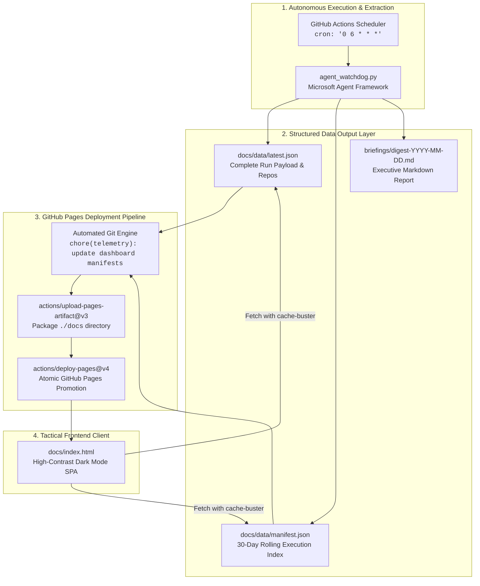

# 🌐 Sentinel Agent — Live GitHub Pages Dashboard Guide
> *"The wheel turns, the ledger marks each sign upon the trail."*  
> *We carve the scout's findings into stone (JSON) for the dashboard to read.*

[](https://github.com/FreeFades2Black/repo-watchdog-agent/actions)
[](https://freefades2black.github.io/repo-watchdog-agent/)
[](docs/index.html)

This guide details the architecture, implementation, and automated deployment of the **Sentinel Agent Live Dashboard** hosted entirely on **GitHub Pages** with **$0.00 infrastructure cost**.

---

## 🏛️ 1. System Architecture

To avoid maintaining dedicated servers, containers, or paid hosting, the pipeline deploys a zero-dependency static single-page application (SPA) directly via GitHub Pages and GitHub Actions workflow artifacts.

```
[GitHub Actions Daily Cron (06:00 UTC)]
                 │
                 ▼
[Sentinel Agent Runs via Python 3.11]
                 │
                 ├─► Writes raw run metadata: `docs/data/latest.json`
                 ├─► Appends run history to: `docs/data/manifest.json` (30-day rolling window)
                 ├─► Commits human-readable dossier: `briefings/digest-YYYY-MM-DD.md`
                 │
                 ▼
[Build Static Site in docs/ Directory]
                 │
                 ▼
[actions/configure-pages@v5 & actions/upload-pages-artifact@v3]
                 │
                 ▼
[actions/deploy-pages@v4]
                 │
                 ▼
[Live GitHub Pages Dashboard (Auto-refreshed, dark tactical UI)]
https://freefades2black.github.io/repo-watchdog-agent/
```

### Architectural Data Flow



The frontend is a zero-dependency, static, single-page application (`docs/index.html`) using vanilla JavaScript to parse the JSON output directly from repository storage.

---

## 📁 2. Directory Layout

```plaintext
repo-watchdog-agent/
├── .github/
│   └── workflows/
│       ├── daily-watchdog.yml          # Headless daily digest generator
│       ├── watchdog-dashboard.yml      # Live dashboard builder & GitHub Pages deployer
│       └── ci.yml                      # PR/Push quality gate & Python test matrix
├── briefings/
│   ├── .gitkeep
│   └── digest-2026-09-10.md            # Markdown intelligence dossiers
├── docs/
│   ├── index.html                      # Tactical dark-mode single page application
│   └── data/
│       ├── manifest.json               # 30-day run history manifest
│       └── latest.json                 # Current run payload & telemetry
├── tests/
│   ├── __init__.py
│   └── test_watchdog.py                # Pytest test suite covering scanner & telemetry
├── agent_watchdog.py                   # Core Sentinel Agent with Telemetry Exporter
├── pytest.ini                          # Test configuration & pythonpath
├── requirements.txt                    # Project dependencies
├── README.md                           # Master system deployment guide
└── GITHUB_PAGES_DASHBOARD.md           # Dashboard deployment & UI architecture guide
```

---

## 📊 3. Data Output Layer (Python Updates)

`agent_watchdog.py` includes the `export_dashboard_telemetry` function to persist structured JSON payloads into `docs/data/` alongside the human-readable Markdown briefing:

### `agent_watchdog.py` (Dashboard Exporter Extension)
```python
# ==============================================================================
# "The wheel turns, the ledger marks each sign upon the trail."
# We carve the scout's findings into stone (JSON) for the dashboard to read.
# ==============================================================================

import os
import json
import datetime
from typing import Dict, Any, List

def export_dashboard_telemetry(
    agent_summary: str,
    repo_reports: List[Dict[str, Any]],
    docs_dir: str = None
):
    """
    Persists structured run data for the static dashboard in docs/data.
    """
    timestamp = datetime.datetime.now(datetime.timezone.utc).isoformat()
    date_str = datetime.datetime.now(datetime.timezone.utc).strftime("%Y-%m-%d")

    base_docs = docs_dir or os.path.join(os.getcwd(), "docs")
    data_dir = os.path.join(base_docs, "data")
    os.makedirs(data_dir, exist_ok=True)

    # 1. Individual Run Payload
    run_payload = {
        "timestamp": timestamp,
        "date": date_str,
        "status": "Success",
        "agent_summary": agent_summary,
        "tracked_repos": repo_reports
    }

    # Write latest run snapshot
    latest_file = os.path.join(data_dir, "latest.json")
    with open(latest_file, "w", encoding="utf-8") as f:
        json.dump(run_payload, f, indent=2)

    # 2. Update Run Manifest (Keep last 30 runs)
    manifest_file = os.path.join(data_dir, "manifest.json")
    manifest = []
    if os.path.exists(manifest_file):
        try:
            with open(manifest_file, "r", encoding="utf-8") as f:
                manifest = json.load(f)
        except (json.JSONDecodeError, OSError):
            manifest = []

    # Insert latest record at the top
    manifest.insert(0, {
        "timestamp": timestamp,
        "date": date_str,
        "status": "Success",
        "summary_snippet": agent_summary[:160] + "..." if len(agent_summary) > 160 else agent_summary
    })

    # Prune history to last 30 entries
    manifest = manifest[:30]

    with open(manifest_file, "w", encoding="utf-8") as f:
        json.dump(manifest, f, indent=2)

    print(f"[+] Watchdog telemetry successfully exported to {data_dir}")
```

### JSON Payload Specifications

#### `docs/data/latest.json`
```json
{
  "timestamp": "2026-09-10T15:38:06.361163+00:00",
  "date": "2026-09-10",
  "status": "Success",
  "agent_summary": "Full markdown text synthesized by the Sentinel...",
  "tracked_repos": [
    {
      "repo": "microsoft/agent-framework",
      "report": "=== Trail Report for: microsoft/agent-framework ===\nRecent Commits Count: 30..."
    }
  ]
}
```

#### `docs/data/manifest.json`
```json
[
  {
    "timestamp": "2026-09-10T15:38:06.361163+00:00",
    "date": "2026-09-10",
    "status": "Success",
    "summary_snippet": "**Generated:** `2026-09-10 15:38:06 UTC` ... Upstream APIs remain stable."
  }
]
```

---

## 💻 4. Frontend Dashboard (`docs/index.html`)

A single, dependency-free HTML/CSS/JS file providing a responsive, high-contrast dark dashboard.

```html
<!DOCTYPE html>
<html lang="en">
<head>
  <meta charset="UTF-8">
  <meta name="viewport" content="width=device-width, initial-scale=1.0">
  <title>Sentinel Agent | Live Dashboard</title>
  <style>
    :root {
      --bg: #0d1117;
      --card-bg: #161b22;
      --border: #30363d;
      --text: #c9d1d9;
      --accent: #58a6ff;
      --green: #2ea043;
      --font-mono: ui-monospace, SFMono-Regular, "SF Mono", Menlo, Consolas, monospace;
    }
    * { box-sizing: border-box; margin: 0; padding: 0; }
    body {
      background: var(--bg);
      color: var(--text);
      font-family: -apple-system, BlinkMacSystemFont, "Segoe UI", Helvetica, Arial, sans-serif;
      padding: 2rem 1rem;
      line-height: 1.5;
    }
    .container { max-width: 1100px; margin: 0 auto; }
    header {
      display: flex;
      justify-content: space-between;
      align-items: center;
      padding-bottom: 1.5rem;
      border-bottom: 1px solid var(--border);
      margin-bottom: 2rem;
    }
    h1 { font-size: 1.5rem; font-weight: 600; color: #fff; }
    .badge {
      display: inline-flex;
      align-items: center;
      gap: 0.4rem;
      background: rgba(46, 160, 67, 0.15);
      color: var(--green);
      padding: 0.3rem 0.6rem;
      border-radius: 20px;
      font-size: 0.8rem;
      font-family: var(--font-mono);
      font-weight: 600;
    }
    .badge::before {
      content: "";
      display: inline-block;
      width: 8px;
      height: 8px;
      border-radius: 50%;
      background: var(--green);
    }
    .grid {
      display: grid;
      grid-template-columns: 2fr 1fr;
      gap: 1.5rem;
    }
    @media (max-width: 800px) {
      .grid { grid-template-columns: 1fr; }
    }
    .card {
      background: var(--card-bg);
      border: 1px solid var(--border);
      border-radius: 6px;
      padding: 1.25rem;
    }
    .card-title {
      font-size: 0.9rem;
      font-weight: 600;
      color: #8b949e;
      text-transform: uppercase;
      letter-spacing: 0.5px;
      margin-bottom: 1rem;
    }
    pre {
      background: #090d12;
      border: 1px solid var(--border);
      border-radius: 4px;
      padding: 1rem;
      font-family: var(--font-mono);
      font-size: 0.85rem;
      color: #e6edf3;
      white-space: pre-wrap;
      max-height: 480px;
      overflow-y: auto;
    }
    .history-list { list-style: none; }
    .history-item {
      padding: 0.75rem 0;
      border-bottom: 1px solid var(--border);
    }
    .history-item:last-child { border-bottom: none; }
    .history-time {
      font-size: 0.75rem;
      font-family: var(--font-mono);
      color: #8b949e;
    }
    .history-snippet {
      font-size: 0.85rem;
      color: var(--text);
      margin-top: 0.25rem;
    }
  </style>
</head>
<body>
  <div class="container">
    <header>
      <div>
        <h1>Sentinel Watchdog Dashboard</h1>
        <p style="color: #8b949e; font-size: 0.85rem; margin-top: 0.25rem;">
          Microsoft Agent Framework Upstream Monitoring Engine
        </p>
      </div>
      <div id="status-badge" class="badge">Checking status...</div>
    </header>

    <div class="grid">
      <!-- Main Column: Latest Run Report -->
      <section class="card">
        <div class="card-title">Latest Intelligence Summary</div>
        <div id="run-metadata" style="font-family: var(--font-mono); font-size: 0.8rem; color: var(--accent); margin-bottom: 0.75rem;">
          Loading execution data...
        </div>
        <pre id="summary-content">Loading agent assessment...</pre>
      </section>

      <!-- Sidebar: Historical Executions -->
      <section class="card">
        <div class="card-title">Run History (30 Days)</div>
        <ul id="history-container" class="history-list">
          <li class="history-item" style="color: #8b949e;">Fetching records...</li>
        </ul>
      </section>
    </div>
  </div>

  <script>
    async function loadDashboard() {
      try {
        // Fetch latest telemetry
        const latestRes = await fetch('./data/latest.json?t=' + Date.now());
        if (latestRes.ok) {
          const latest = await latestRes.json();
          document.getElementById('status-badge').textContent = latest.status || 'Active';
          document.getElementById('run-metadata').textContent = `Executed: ${latest.timestamp}`;
          document.getElementById('summary-content').textContent = latest.agent_summary || 'No content provided.';
        } else {
          document.getElementById('summary-content').textContent = 'No run records deployed yet.';
        }

        // Fetch manifest history
        const manifestRes = await fetch('./data/manifest.json?t=' + Date.now());
        if (manifestRes.ok) {
          const history = await manifestRes.json();
          const container = document.getElementById('history-container');
          container.innerHTML = '';

          history.forEach(run => {
            const li = document.createElement('li');
            li.className = 'history-item';
            li.innerHTML = `
              <div class="history-time">${run.timestamp.replace('T', ' ').slice(0, 19)} UTC</div>
              <div class="history-snippet">${run.summary_snippet}</div>
            `;
            container.appendChild(li);
          });
        }
      } catch (err) {
        console.error('Dashboard load failure:', err);
      }
    }

    loadDashboard();
  </script>
</body>
</html>
```

---

## ⚙️ 5. GitHub Actions Deployment Workflow

The workflow executes the Python agent, pushes changes to Git, and uses the official `actions/deploy-pages` action to publish the static site directly without requiring a separate `gh-pages` branch.

### `.github/workflows/watchdog-dashboard.yml`
```yaml
name: Watchdog Engine & Dashboard Deployment

on:
  schedule:
    - cron: '0 6 * * *'
  workflow_dispatch:

permissions:
  contents: write
  pages: write
  id-token: write
  models: read

concurrency:
  group: "pages"
  cancel-in-progress: false

jobs:
  run-and-deploy:
    environment:
      name: github-pages
      url: ${{ steps.deployment.outputs.page_url }}
    runs-on: ubuntu-latest
    steps:
      - name: Checkout Code
        uses: actions/checkout@v4
        with:
          token: ${{ secrets.GITHUB_TOKEN }}
          fetch-depth: 0

      - name: Setup Python
        uses: actions/setup-python@v5
        with:
          python-version: '3.11'
          cache: 'pip'

      - name: Install Dependencies
        run: pip install -r requirements.txt

      - name: Execute Watchdog Agent
        env:
          GITHUB_TOKEN: ${{ secrets.GITHUB_TOKEN }}
          MODEL_NAME: "gpt-4o"
          AZURE_OPENAI_API_KEY: ${{ secrets.AZURE_OPENAI_API_KEY }}
          AZURE_OPENAI_ENDPOINT: ${{ secrets.AZURE_OPENAI_ENDPOINT }}
          MODEL_DEPLOYMENT_NAME: ${{ secrets.MODEL_DEPLOYMENT_NAME }}
        run: python agent_watchdog.py

      - name: Commit Persisted Data
        run: |
          git config --global user.name "Gunslinger Sentinel"
          git config --global user.email "actions@github.com"
          git add docs/data/ briefings/
          if ! git diff --cached --quiet; then
            git commit -m "chore(telemetry): update dashboard manifests [$(date +'%Y-%m-%d')]"
            git push origin HEAD:${{ github.ref_name }}
          fi

      - name: Setup Pages
        uses: actions/configure-pages@v5

      - name: Upload Pages Artifact
        uses: actions/upload-pages-artifact@v3
        with:
          path: './docs'

      - name: Deploy to GitHub Pages
        id: deployment
        uses: actions/deploy-pages@v4
```

---

## 🚀 6. Verification and Activation

### Step 1: Enable GitHub Pages in Repository Settings
1. In your GitHub repository, navigate to **Settings** → **Pages**.
2. Under **Build and deployment** → **Source**, select **GitHub Actions** (not *"Deploy from a branch"*).
3. The custom environment `github-pages` will automatically be created upon first deployment.

### Step 2: Trigger the Workflow Manually
1. Go to the **Actions** tab in GitHub.
2. Select **Watchdog Engine & Dashboard Deployment**.
3. Click **Run workflow** → Select branch `main` → Click **Run workflow**.

### Step 3: Access Live Dashboard
Once the deployment job completes, the live URL will be active at:
**`https://<username>.github.io/<repository-name>/`**

For this repository:
👉 **[https://freefades2black.github.io/repo-watchdog-agent/](https://freefades2black.github.io/repo-watchdog-agent/)**

---

## 🛡️ 7. Operational Guarantees

* **Zero-Cold-Start Ingestion:** Static JSON caching eliminates database lookups and backend cold starts.
* **Cache Busting:** Requests append `?t=<Date.now()>` ensuring immediate UI updates upon pipeline completion.
* **30-Day Rolling History:** `manifest.json` automatically prunes runs older than 30 cycles to maintain minimal bundle footprint.
* **Idempotent Git Commits:** `git diff --cached --quiet` ensures no empty commits occur if no new telemetry was generated.