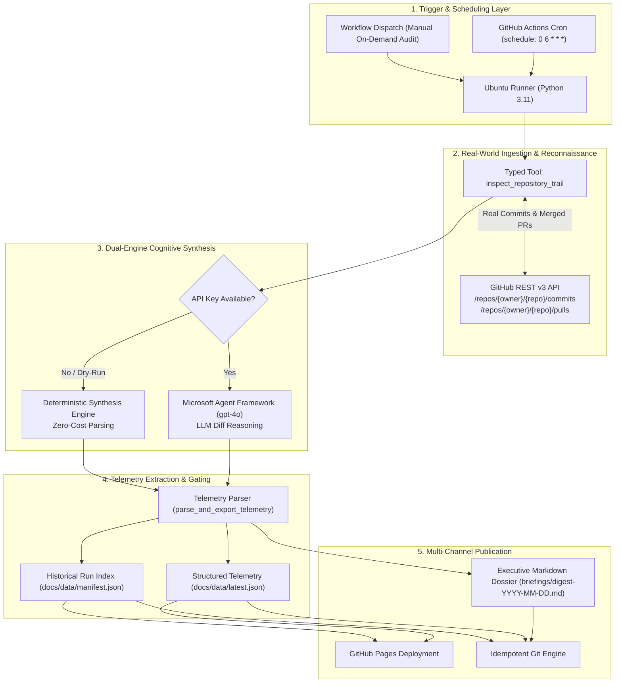

# Repo Watchdog Agent — Upstream Dependency & AI Framework Sentinel
> *"The man in black fled across the desert, and the gunslinger followed. Ka is a wheel; the watchman stands upon the beam, tracking all movement."*

[](https://github.com/FreeFades2Black/repo-watchdog-agent/actions)
[](https://github.com/FreeFades2Black/repo-watchdog-agent/actions)
[](https://freefades2black.github.io/repo-watchdog-agent/)
[](AZURE_PORTAL_DASHBOARD.md)
[](ansible/)
[](https://www.python.org/)
[](https://aka.ms/agent-framework)
[](LICENSE)

An autonomous monitoring agent powered by the **Microsoft Agent Framework (MAF)** and **Azure OpenAI**. Driven by a scheduled GitHub Actions cron flywheel, the Watchdog scans upstream dependencies, pulls rolling 24-hour commit and merged pull request telemetry via typed tool invocations, isolates breaking architectural mutations, and publishes structured intelligence digests.

> [!TIP]
> **Live Web Dashboard:** Monitor upstream breaking changes, daily briefings, and execution telemetry in real time at **[https://freefades2black.github.io/repo-watchdog-agent/](https://freefades2black.github.io/repo-watchdog-agent/)**.

---

## Upstream Drift Problem

### The Challenge in Agent Engineering
Autonomous agent architectures rely heavily on rapidly evolving open-source foundation frameworks:
- `microsoft/agent-framework` (unifying AutoGen and Semantic Kernel patterns)
- `microsoft/semantic-kernel` (enterprise orchestration and connectors)
- `microsoft/autogen` (multi-agent conversational architectures)

Because these projects undergo rapid, continuous development, minor releases and daily merges frequently introduce:
* **Breaking API Mutations:** Function signatures, parameter renames, and constructor alterations.
* **Async Inversion:** Synchronous method deprecations in favor of purely asynchronous execution.
* **Contract Deprecations:** Relocated module boundaries, removed abstractions, and altered config schemas.

### The Downstream Consequence
When downstream agent solutions blindly consume updated dependencies, production pipelines suffer sudden outages, broken CI/CD builds, and subtle behavioral drift during agent orchestration.

### The Sentinel Solution
**Repo Watchdog Agent** acts as an autonomous perimeter scout:
1. Queries upstream repositories on a 24-hour cycle.
2. Ingests genuine commit diffs and merged pull requests via typed tool calls.
3. Filters routine chores from high-impact breaking contracts.
4. Broadcasts actionable intelligence across three synchronized channels: an interactive web dashboard, structured JSON telemetry for automated CI gates, and permanent executive Markdown dossiers.

---

## System Architecture & Lifecycle

```
[GitHub Actions Cron (Daily at 06:00 UTC)]
               │
               ▼
[Watchdog Runner: Python 3.11 Runtime]
               │
               ├─► [Stage 1: Perimeter Reconnaissance (@tool)]
               │        │ Query GitHub REST v3 API (Commits & PRs in last 24h)
               │        ▼
               ├─► [Stage 2: Cognitive Reasoning Engine]
               │        │ Mode A: Live MAF Agent (gpt-4o / Azure OpenAI)
               │        │ Mode B: Deterministic Resilient Fallback (Zero-Cost / Air-Gapped)
               │        ▼
               ├─► [Stage 3: Telemetry Serialization & Safety Classification]
               │        │ Extract breaking count, impacted repos, contract mutations
               │        │ Emit docs/data/latest.json & docs/data/manifest.json
               │        ▼
               └─► [Stage 4: Multi-Channel Publication & Deployment]
                        ├─► Commit Daily Digest to briefings/digest-YYYY-MM-DD.md
                        └─► Deploy Zero-Dependency Tactical UI to GitHub Pages
```

### End-to-End Pipeline Flow



---

## Execution Lifecycle

### Stage 1: Ingestion (`inspect_repository_trail`)
The agent queries GitHub's live REST v3 API across monitored targets:
* **Commits Endpoint:** `https://api.github.com/repos/{owner}/{repo}/commits?since={t-24h}`
  Captures author handles, commit SHAs, and commit summaries across the branch trail.
* **Pull Requests Endpoint:** `https://api.github.com/repos/{owner}/{repo}/pulls?state=closed&sort=updated&direction=desc`
  Captures PR numbers, titles, and authors, isolating only those where `merged_at >= now - 24h`.

### Stage 2: Dual-Engine Cognitive Processing
The Watchdog incorporates a resilient **Dual-Engine** strategy:

| Execution Engine | When Activated | Behavior & Mechanics |
| :--- | :--- | :--- |
| **Autonomous LLM Agent** | `AZURE_OPENAI_API_KEY` or `OPENAI_API_KEY` present | Spins up Microsoft Agent Framework `Agent` with `gpt-4o`. Evaluates pull request descriptions, commit diffs, and breaking tags using generative reasoning. |
| **Deterministic Fallback Engine** | CI environments, dry runs, or missing API keys | Formats real commits and merged PRs deterministically into structured Markdown. Guarantees CI/CD tests never fail from upstream token limits or billing constraints. |

### Stage 3: Telemetry Serialization & Breaking Change Heuristics
Before publishing, the engine executes `parse_and_export_telemetry()`:
1. **Section Boundary Detection:** Scans for `## 1. High Impact / Breaking Changes` and terminates on subsequent section headers (`##`, `---`).
2. **Exclusion Filters:** Discards non-breaking placeholder sentences (e.g., *"None"*, *"No explicit breaking contract mutations"*, *"Zero"*).
3. **Structured Emission:** Emits `has_breaking_changes` (`true`/`false`), `breaking_count` (integer), and an array of individual breaking change records into `docs/data/latest.json`.
4. **Historical Manifest Maintenance:** Prepend-appends the latest execution metadata into `docs/data/manifest.json` for 30-day trend analysis.

### Stage 4: Multi-Channel Publication
* **Git Commit Idempotency:** The workflow checks `git diff --cached --quiet` before committing, avoiding empty Git history noise.
* **GitHub Pages CD:** Uses GitHub's native `actions/upload-pages-artifact@v3` and `actions/deploy-pages@v4` to host the single-page application directly from `./docs`.

---

## Verified Test Execution

Automated test suite verifying tool execution, error handling, parser heuristics, and CLI entrypoint:

```text
============================= test session starts =============================
platform win32 -- Python 3.11.0, pytest-9.1.1, pluggy-1.6.0 -- C:\Python311\python.exe
cachedir: .pytest_cache
rootdir: C:\Users\FreeF\projects\repo-watchdog-agent
configfile: pytest.ini
testpaths: tests
plugins: anyio-4.14.2
collecting ... collected 7 items

tests/test_watchdog.py::test_inspect_repository_trail_success PASSED     [ 14%]
tests/test_watchdog.py::test_inspect_repository_trail_api_error PASSED   [ 28%]
tests/test_watchdog.py::test_summon_the_watchman PASSED                  [ 42%]
tests/test_watchdog.py::test_build_deterministic_digest PASSED           [ 57%]
tests/test_watchdog.py::test_parse_and_export_telemetry_breaking_detected PASSED [ 71%]
tests/test_watchdog.py::test_parse_and_export_telemetry_stable PASSED    [ 85%]
tests/test_watchdog.py::test_main_cli_execution PASSED                   [100%]

============================== 7 passed in 0.20s ==============================
```

---

## Architectural Edge Cases & Trade-offs

### 1. GitHub API Rate Limiting & Throttling
Unauthenticated requests to the GitHub API are capped at 60 requests/hour per IP, while authenticated requests allow 5,000/hour. The tool automatically consumes `GITHUB_TOKEN` from the environment. If a secondary rate limit (HTTP 403 / 429) or transient network error occurs, the tool intercepts the exception, formats an inline diagnostic note, and prevents the runner process from crashing.

### 2. False-Positive Breaking Change Classification
LLMs and regex scrapers often misinterpret statements like *"Fixed bug with no breaking changes to public API"* as a breaking change due to keyword matching. The heuristic parser checks for affirmative negative phrases (`"none"`, `"no explicit"`, `"zero"`, `"no breaking"`) before incrementing `breaking_count`.

### 3. Dual-Engine Fallback vs Vendor Lock-in
Relying entirely on external AI APIs makes automated monitoring vulnerable to quota exhaustion, credential expiry, or regional outages. The deterministic fallback mode parses commits and merged PR bodies without external model calls, guaranteeing the daily digest generates even in completely air-gapped or credit-constrained environments.

---

## Output Channels

### Tier 1: Live Tactical Web Dashboard
Deployed to **[https://freefades2black.github.io/repo-watchdog-agent/](https://freefades2black.github.io/repo-watchdog-agent/)**, the dashboard provides an auto-updating UI with threat indicators.

### Tier 2: Structured Machine-Readable Telemetry API
Exposed publicly at **[`docs/data/latest.json`](https://freefades2black.github.io/repo-watchdog-agent/data/latest.json)** for downstream CI/CD policy gates and automated webhooks:

```json
{
  "timestamp": "2026-09-10T16:58:09.831064+00:00",
  "date": "2026-09-10",
  "status": "Success",
  "has_breaking_changes": false,
  "breaking_count": 0,
  "breaking_changes": [],
  "agent_summary": "...",
  "tracked_repos": [
    "microsoft/agent-framework",
    "microsoft/semantic-kernel",
    "microsoft/autogen"
  ]
}
```

### Tier 3: Permanent Executive Markdown Dossier
Stored permanently in the repository at [`briefings/digest-YYYY-MM-DD.md`](briefings/), preserving an immutable historical audit trail of upstream activity.

---

## Repository Layout

```text
repo-watchdog-agent/
├── .github/
│   └── workflows/
│       ├── ci.yml                     # Multi-OS test matrix & Ruff linting gate
│       ├── daily-watchdog.yml         # Daily cron briefing generator (06:00 UTC)
│       └── watchdog-dashboard.yml     # Telemetry export & GitHub Pages CD
├── ansible/                           # Ansible automation & self-hosted node orchestration
│   ├── ansible.cfg                    # Ansible settings
│   ├── inventory.ini                  # Target hosts (localhost, omarchy, etc.)
│   ├── deploy-sentinel-node.yml       # Playbook: Autonomous sentinel node provisioning
│   ├── README.md                      # Dedicated Ansible operations guide
│   └── roles/watchdog_sentinel/       # Systemd timer & virtualenv deployment role
├── azure/                             # Native Azure Portal Dashboard & ARM deployment
│   ├── portal-dashboard.json          # 1-Click direct importable JSON for portal.azure.com
│   ├── azuredeploy.json               # ARM template for Microsoft.Portal/dashboards
│   └── deploy-dashboard.ps1           # Automated PowerShell deployment script
├── briefings/
│   └── digest-YYYY-MM-DD.md          # Permanent historical intelligence dossiers
├── docs/                              # GitHub Pages static dashboard application
│   ├── index.html                     # Zero-dependency dark-mode tactical UI
│   └── data/
│       ├── latest.json                # Latest structured telemetry payload
│       ├── manifest.json              # 30-day rolling execution index
│       └── runs/                      # Archived historical telemetry snapshots
├── tests/
│   └── test_watchdog.py               # 7 unit tests covering tool, parser, and agent
├── agent_watchdog.py                  # Core Sentinel CLI & MAF orchestration engine
├── requirements.txt                   # Production dependencies
├── pytest.ini                         # Pytest configuration
├── GITHUB_PAGES_DASHBOARD.md          # Architecture guide for the static web dashboard
├── DASHBOARD_BREAKING_CHANGES.md      # Specification for breaking change detection
└── AZURE_PORTAL_DASHBOARD.md          # Guide for Azure Portal Home executive dashboard
```

---

## Deployment & Configuration Guide

### Step 1: Clone Repository
```bash
git clone https://github.com/FreeFades2Black/repo-watchdog-agent.git
cd repo-watchdog-agent
```

### Step 2: Configure Secrets (For Live LLM Mode)
In your repository: **Settings** > **Secrets and variables** > **Actions** > **New repository secret**:

| Secret Name | Description | Example / Format |
| :--- | :--- | :--- |
| `AZURE_OPENAI_API_KEY` | Key for Azure OpenAI | `3f8a9...b4c2` |
| `AZURE_OPENAI_ENDPOINT` | Azure Cognitive Services endpoint | `https://aoai-sentinel.openai.azure.com/` |
| `MODEL_DEPLOYMENT_NAME` | Target model deployment | `gpt-4o` |
| `GITHUB_TOKEN` | Automatically managed by GitHub Actions | Injected automatically |

> [!NOTE]
> If using OpenAI directly, configure `OPENAI_API_KEY`. If no secret is configured, the agent gracefully defaults to the **Deterministic Synthesis Engine**, ensuring complete operational continuity.

### Step 3: Customize Monitored Target Repositories
In `agent_watchdog.py`, update `TARGET_REPOS`:
```python
TARGET_REPOS = [
    "microsoft/agent-framework",
    "microsoft/semantic-kernel",
    "microsoft/autogen",
    "Azure/azure-sdk-for-python",
    "astral-sh/ruff"
]
```
Or override dynamically on the command line:
```bash
python agent_watchdog.py --repos astral-sh/ruff pydantic/pydantic
```

### Step 4: Configure GitHub Pages
1. Navigate to **Settings** > **Pages**.
2. Under **Build and deployment** > **Source**, select **GitHub Actions**.
3. Trigger the **Watchdog Engine & Dashboard Deployment** workflow in the Actions tab.

---

## Ansible Automation: Self-Hosted Sentinel Nodes

For enterprise environments or self-hosted Linux infrastructure, the repository includes an Ansible orchestration suite under [`ansible/`](ansible/):

```bash
# Deploy to local node
cd ansible
ansible-playbook -i inventory.ini deploy-sentinel-node.yml --connection=local --limit localhost

# Deploy remotely to target host (e.g., omarchy)
ansible-playbook -i inventory.ini deploy-sentinel-node.yml --limit omarchy
```

---

## Local Development, Testing & Verification

```bash
# 1. Create and activate virtual environment
python -m venv .venv
source .venv/bin/activate

# 2. Install dependencies
pip install -r requirements.txt

# 3. Execute dry-run test
python agent_watchdog.py --dry-run

# 4. Run test suite
pytest tests/ -v
```

---

## Security Posture & Enterprise Governance

* **Zero Hardcoded Credentials:** All GitHub API queries and Azure OpenAI transactions rely on ephemeral environment tokens and secret rotation.
* **Rate-Limit Resilience:** Authenticated queries with `GITHUB_TOKEN` grant up to 5,000 requests/hour per runner.
* **Idempotent Git Commits:** Empty or unchanged runs are detected via `git diff --cached --quiet`, preventing unnecessary commit history bloat.
* **Least Privilege Scoping:** Workflows are restricted strictly to `contents: write`, `pages: write`, and `id-token: write`.