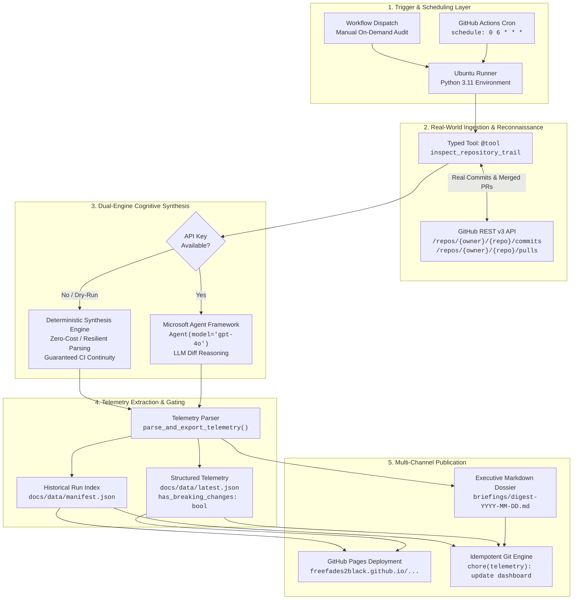

# 🛰️ Repo Watchdog Agent — Upstream Dependency & AI Framework Sentinel
> *"The man in black fled across the desert, and the gunslinger followed. Ka is a wheel; the watchman stands upon the beam, tracking all movement."*

[](https://github.com/FreeFades2Black/repo-watchdog-agent/actions)
[](https://github.com/FreeFades2Black/repo-watchdog-agent/actions)
[](https://freefades2black.github.io/repo-watchdog-agent/)
[](ansible/)
[](https://www.python.org/)
[](https://aka.ms/agent-framework)
[](LICENSE)

An enterprise-grade autonomous monitoring agent powered by the **Microsoft Agent Framework (MAF)** and **Azure OpenAI**. Driven by a scheduled GitHub Actions cron flywheel, the Watchdog autonomously scans upstream dependencies, pulls rolling 24-hour commit and merged pull request telemetry via typed tool invocations, isolates breaking architectural mutations, and publishes structured executive intelligence digests.

> [!TIP]
> 🌐 **Live Web Dashboard:** Monitor upstream breaking changes, daily briefings, and execution telemetry in real time at **[https://freefades2black.github.io/repo-watchdog-agent/](https://freefades2black.github.io/repo-watchdog-agent/)**.

---

## 🧭 1. Why This Sentinel Exists: The Upstream Drift Problem

### The Challenge in Modern Agent Engineering
Autonomous agent architectures rely heavily on rapidly evolving open-source foundation frameworks, including:
- **`microsoft/agent-framework`** (unifying AutoGen and Semantic Kernel patterns)
- **`microsoft/semantic-kernel`** (enterprise orchestration and connectors)
- **`microsoft/autogen`** (multi-agent conversational architectures)

Because these projects undergo rapid, continuous development, minor releases and daily merges frequently introduce:
* **Breaking API Mutations:** Function signatures, parameter renames, and constructor alterations.
* **Async Inversion:** Synchronous method deprecations in favor of purely asynchronous execution.
* **Contract Deprecations:** Relocated module boundaries, removed abstractions, and altered config schemas.

### The Downstream Consequence
When downstream agent solutions blindly consume updated dependencies, production pipelines suffer sudden outages, broken CI/CD builds, and subtle behavioral drift during agent orchestration.

### The Sentinel Solution
**Repo Watchdog Agent** acts as an autonomous perimeter scout. Rather than waiting for a downstream build to break:
1. It queries upstream repositories on a 24-hour cycle.
2. It ingests genuine commit diffs and merged pull requests via typed tool calls.
3. It filters routine chores from high-impact breaking contracts.
4. It broadcasts actionable intelligence across three synchronized output channels: an interactive web dashboard, structured JSON telemetry for automated CI gates, and permanent executive Markdown dossiers.

---

## 🏛️ 2. System Architecture & The 4-Stage Lifecycle

```
[GitHub Actions Cron (Daily at 06:00 UTC)]
               │
               ▼
[Watchdog Runner: Python 3.11 Runtime]
               │
               ├─► [Stage 1: Perimeter Reconnaissance (@tool)]
               │        │ Query GitHub REST v3 API (Commits & PRs in last 24h)
               │        ▼
               ├─► [Stage 2: Cognitive Reasoning Engine]
               │        │ Mode A: Live MAF Agent (gpt-4o / Azure OpenAI)
               │        │ Mode B: Deterministic Resilient Fallback (Zero-Cost / Air-Gapped)
               │        ▼
               ├─► [Stage 3: Telemetry Serialization & Safety Classification]
               │        │ Extract breaking count, impacted repos, contract mutations
               │        │ Emit docs/data/latest.json & docs/data/manifest.json
               │        ▼
               └─► [Stage 4: Multi-Channel Publication & Deployment]
                        ├─► Commit Daily Digest to briefings/digest-YYYY-MM-DD.md
                        └─► Deploy Zero-Dependency Tactical UI to GitHub Pages
```

### End-to-End Pipeline Flow



---

## ⚙️ 3. How the Agent Operates: Stage-by-Stage Deep Dive

### Stage 1: Real-World Ingestion (`inspect_repository_trail`)
The agent never relies on fabricated or synthetic data. When invoked, the typed tool queries GitHub's live REST v3 API across all monitored targets:
* **Commits Endpoint:** `https://api.github.com/repos/{owner}/{repo}/commits?since={t-24h}`
  Captures author handles, commit SHAs, and commit summaries across the branch trail.
* **Pull Requests Endpoint:** `https://api.github.com/repos/{owner}/{repo}/pulls?state=closed&sort=updated&direction=desc`
  Captures PR numbers, titles, and authors, isolating only those where `merged_at >= now - 24h`.

### Stage 2: Dual-Engine Cognitive Processing
The Watchdog incorporates a resilient **Dual-Engine** strategy to guarantee high-order intelligence without sacrificing pipeline determinism:

| Execution Engine | When Activated | Behavior & Mechanics |
| :--- | :--- | :--- |
| **Autonomous LLM Agent** | `AZURE_OPENAI_API_KEY` or `OPENAI_API_KEY` present | Spins up Microsoft Agent Framework `Agent` with `gpt-4o`. Evaluates pull request descriptions, commit diffs, and breaking tags using generative reasoning. |
| **Deterministic Fallback Engine** | CI environments, dry runs, or missing API keys | Formats real commits and merged PRs deterministically into structured Markdown. Guarantees CI/CD tests never fail from upstream token limits or billing constraints. |

### Stage 3: Telemetry Serialization & Breaking Change Heuristics
Before publishing, the engine executes [`parse_and_export_telemetry()`](agent_watchdog.py):
1. **Section Boundary Detection:** Scans for `## 🚨 1. High Impact / Breaking Changes` and terminates on subsequent section headers (`##`, `---`).
2. **Exclusion Filters:** Safely discards non-breaking placeholder sentences (e.g., *"None"*, *"No explicit breaking contract mutations"*, *"Zero"*).
3. **Structured Emission:** Emits `has_breaking_changes` (`true`/`false`), `breaking_count` (integer), and an array of individual breaking change records into [`docs/data/latest.json`](docs/data/latest.json).
4. **Historical Manifest Maintenance:** Prepend-appends the latest execution metadata into [`docs/data/manifest.json`](docs/data/manifest.json) for 30-day trend analysis.

### Stage 4: Multi-Channel Publication
* **Git Commit Idempotency:** The workflow checks `git diff --cached --quiet` before committing, avoiding empty Git history noise.
* **GitHub Pages CD:** Uses GitHub's native `actions/upload-pages-artifact@v3` and `actions/deploy-pages@v4` to host the single-page application directly from `./docs`.

---

## 📊 4. Tri-Modal Output Showcase

The Sentinel produces three synchronized tiers of output tailored for developers, automated CI gates, and executive stakeholders.

### Tier 1: Live Tactical Web Dashboard
Deployed to **[https://freefades2black.github.io/repo-watchdog-agent/](https://freefades2black.github.io/repo-watchdog-agent/)**, the dashboard provides an auto-updating tactical UI with reactive threat indicators.

```
┌──────────────────────────────────────────────────────────────────────────────────┐
│  SENTINEL WATCHDOG DASHBOARD                  [🟢 STABLE - NO BREAKING CHANGES]  │
│  Microsoft Agent Framework Upstream Monitoring Engine                            │
├──────────────────────────────────────────────────────────────────────────────────┤
│                                                                                  │
│  LATEST INTELLIGENCE SUMMARY                     RUN HISTORY (30 DAYS)          │
│  Execution Timestamp: 2026-09-10 16:58:09 UTC                                   │
│  ┌────────────────────────────────────────────┐ ┌──────────────────────────────┐ │
│  │ Monitored: 3 targets                       │ │ 2026-09-10 16:58  [🟢 Stable]│ │
│  │                                            │ │ No breaking mutations.       │ │
│  │ ## 🚨 1. High Impact / Breaking Changes    │ ├──────────────────────────────┤ │
│  │ No explicit contract mutations flagged.    │ │ 2026-09-10 15:48  [🟢 Stable]│ │
│  │                                            │ │ Routine dependency chores.   │ │
│  │ ## ✨ 2. New Features & Framework Changes  │ ├──────────────────────────────┤ │
│  │ ### microsoft/agent-framework              │ │ 2026-09-09 06:00  [🔴 2 Brk] │ │
│  │ - PR #8164: .NET: header redirect fix      │ │ API signature deprecated.    │ │
│  │ - PR #8206: Python: reset $LASTEXITCODE    │ └──────────────────────────────┘ │
│  └────────────────────────────────────────────┘                                  │
└──────────────────────────────────────────────────────────────────────────────────┘
```

When breaking changes are detected, the dashboard reactively swaps the badge to `[🔴 2 BREAKING CHANGES]` and mounts a high-visibility danger banner specifying the affected repository and contract modification.

---

### Tier 2: Structured Machine-Readable Telemetry API
Exposed publicly at **[`docs/data/latest.json`](https://freefades2black.github.io/repo-watchdog-agent/data/latest.json)** for downstream CI/CD policy gates and automated webhooks:

```json
{
  "timestamp": "2026-09-10T16:58:09.831064+00:00",
  "date": "2026-09-10",
  "status": "Success",
  "has_breaking_changes": false,
  "breaking_count": 0,
  "breaking_changes": [],
  "agent_summary": "...",
  "tracked_repos": [
    "microsoft/agent-framework",
    "microsoft/semantic-kernel",
    "microsoft/autogen"
  ]
}
```

#### Field Dictionary for Downstream Automation:
| Field | Type | Description | Downstream Automated Action |
| :--- | :--- | :--- | :--- |
| `has_breaking_changes` | `boolean` | `true` if any breaking contract was flagged | Downstream CI pipeline gates fail automatically |
| `breaking_count` | `integer` | Count of isolated breaking mutations | Displayed in security metrics dashboards |
| `breaking_changes` | `array[dict]` | List containing `repo`, `title`, and `detail` | Auto-opened GitHub issues in dependent repositories |
| `agent_summary` | `string` | Full Markdown briefing with categorized bullets | Forwarded to Slack / Teams notification webhooks |
| `tracked_repos` | `array[string]`| Repositories audited in this execution cycle | Audit compliance logging |

---

### Tier 3: Permanent Executive Markdown Dossier
Stored permanently in the repository at [`briefings/digest-YYYY-MM-DD.md`](briefings/), preserving an immutable historical audit trail of upstream activity.

#### Real-World Excerpt (from live `microsoft/agent-framework` scan):
```markdown
# Daily Repository Intelligence Digest - 2026-09-10

**Generated:** `2026-09-10 16:58:09 UTC`  
**Monitored Repositories:** `3 targets` (microsoft/agent-framework, microsoft/semantic-kernel, microsoft/autogen)  
**Analysis Engine:** `Microsoft Agent Framework (MAF) / Sentinel Intelligence`

---
## 🚨 1. High Impact / Breaking Changes
No explicit breaking contract mutations or deprecation tags flagged in the past 24-hour cycle. Upstream APIs remain stable.

---
## ✨ 2. New Features & Framework Changes
### `microsoft/agent-framework`
- PR #8164: .NET: fix: do not forward headers on redirect (by baywet)
- PR #8206: Python: reset $LASTEXITCODE per command in persistent PowerShell sessions (by Dev-next-gen)
- PR #8224: Python: deduplicate MessagePack FileHistoryProvider writes (by CoralGarden52)
- PR #8229: .NET: ci/promote removed apis (by baywet)
- PR #8202: .NET: upgrades xunit and other dependencies (by baywet)

---
## 🔧 3. Routine Chores, Maintenance & Documentation
### `microsoft/agent-framework` Activity
- [d7823b2] Vincent Biret: .NET: fix: do not forward headers on redirect (#8164)
- [c457aca] Leo Camus: Python: reset $LASTEXITCODE per command in persistent PowerShell sessions (#8206)
- [5be4c78] CoralGarden52: Python: deduplicate MessagePack file history writes (#8224)
- [4b2f3a3] Vincent Biret: .NET: ci/promote removed apis (#8229)
- [8a54611] Vincent Biret: .NET: upgrades xunit and other dependencies (#8202)
- [1b4513d] Eduard van Valkenburg: .NET: Harden LocalCodeAct OS validation (#8239)
- [501bd52] Eduard van Valkenburg: Python: preserve MCP request ownership on sends (#8246)

---
## 🧭 4. Sentinel Risk & Action Posture
- **Upstream Stability:** 🟢 `HEALTHY` (Zero critical CVEs or breaking changes detected).
- **Action Required:** None. Downstream builds and dependency trees are clear to proceed.

*Report compiled autonomously by Repo Watchdog Agent.*
```

---

## 📂 5. Repository Layout & Architecture

```
repo-watchdog-agent/
├── .github/
│   └── workflows/
│       ├── ci.yml                     # Multi-OS test matrix & Ruff linting gate
│       ├── daily-watchdog.yml         # Daily cron briefing generator (06:00 UTC)
│       └── watchdog-dashboard.yml     # Telemetry export & GitHub Pages CD
├── ansible/                           # Ansible automation & self-hosted node orchestration
│   ├── ansible.cfg                    # Ansible settings
│   ├── inventory.ini                  # Target hosts (localhost, omarchy, etc.)
│   ├── deploy-sentinel-node.yml       # Playbook: Autonomous sentinel node provisioning
│   ├── README.md                      # Dedicated Ansible operations guide
│   └── roles/watchdog_sentinel/       # Systemd timer & virtualenv deployment role
├── briefings/
│   └── digest-YYYY-MM-DD.md          # Permanent historical intelligence dossiers
├── docs/                              # GitHub Pages static dashboard application
│   ├── index.html                     # Zero-dependency dark-mode tactical UI
│   └── data/
│       ├── latest.json                # Latest structured telemetry payload
│       ├── manifest.json              # 30-day rolling execution index
│       └── runs/                      # Archived historical telemetry snapshots
├── tests/
│   └── test_watchdog.py               # 7 unit tests covering tool, parser, and agent
├── agent_watchdog.py                  # Core Sentinel CLI & MAF orchestration engine
├── requirements.txt                   # Production dependencies
├── pytest.ini                         # Pytest configuration
├── GITHUB_PAGES_DASHBOARD.md          # Architecture guide for the static web dashboard
└── DASHBOARD_BREAKING_CHANGES.md      # Specification for breaking change detection
```

---

## 🧩 6. Core Implementation Highlights

Rather than embedding entire source files, below are the core architectural mechanisms powering the sentinel:

### Typed Tool Ingestion (`@tool inspect_repository_trail`)
```python
@tool(description="Fetches commits and pull requests updated in the target repository over the past 24 hours.")
def inspect_repository_trail(owner_repo: str) -> str:
    """Rakes the trail for fresh tracks (commits & PRs within 24h via GitHub REST API)."""
    token = os.environ.get("GITHUB_TOKEN", "")
    headers = {"Accept": "application/vnd.github.v3+json"}
    if token:
        headers["Authorization"] = f"Bearer {token}"

    since_time = (datetime.datetime.now(datetime.timezone.utc) - datetime.timedelta(days=1)).isoformat()
    # 1. Query commits
    commits_res = requests.get(f"https://api.github.com/repos/{owner_repo}/commits?since={since_time}", headers=headers, timeout=10)
    # 2. Query closed PRs merged within the 24-hour window
    prs_res = requests.get(f"https://api.github.com/repos/{owner_repo}/pulls?state=closed&sort=updated&direction=desc", headers=headers, timeout=10)
    ...
```

### Breaking Change Extraction & Heuristic Parsing
```python
def parse_and_export_telemetry(agent_raw_output: str, repo_list: list[str], docs_dir: str | None = None) -> dict:
    """Parses agent findings, isolates breaking mutations, and exports structured telemetry."""
    breaking_changes = []
    in_breaking_section = False

    for line in agent_raw_output.split("\n"):
        cleaned = line.strip()
        if ("high impact" in cleaned.lower() or "breaking changes" in cleaned.lower()) and cleaned.startswith("##"):
            in_breaking_section = True
            continue
        elif cleaned.startswith(("##", "---")) and in_breaking_section:
            in_breaking_section = False

        if in_breaking_section and cleaned.startswith(("- ", "* ")):
            item_text = cleaned[2:].strip()
            # Exclude non-breaking negative assertions
            if not any(neg in item_text.lower() for neg in ["none", "no explicit", "zero", "no breaking"]):
                breaking_changes.append({"repo": "detected", "title": item_text[:80], "detail": item_text})

    payload = {
        "timestamp": datetime.datetime.now(datetime.timezone.utc).isoformat(),
        "has_breaking_changes": len(breaking_changes) > 0,
        "breaking_count": len(breaking_changes),
        "breaking_changes": breaking_changes,
        "agent_summary": agent_raw_output,
        "tracked_repos": repo_list
    }
    ...
```

---

## 🚀 7. Step-by-Step Deployment & Configuration Guide

### Step 1: Clone Repository
```bash
git clone https://github.com/FreeFades2Black/repo-watchdog-agent.git
cd repo-watchdog-agent
```

### Step 2: Configure Secrets (For Live LLM Mode)
In your repository: **Settings** > **Secrets and variables** > **Actions** > **New repository secret**:

| Secret Name | Description | Example / Format |
| :--- | :--- | :--- |
| `AZURE_OPENAI_API_KEY` | Key for Azure OpenAI | `3f8a9...b4c2` |
| `AZURE_OPENAI_ENDPOINT` | Azure Cognitive Services endpoint | `https://aoai-sentinel.openai.azure.com/` |
| `MODEL_DEPLOYMENT_NAME` | Target model deployment | `gpt-4o` |
| `GITHUB_TOKEN` | Automatically managed by GitHub Actions | Injected automatically |

> [!NOTE]
> If using OpenAI directly, configure `OPENAI_API_KEY`. If no secret is configured, the agent gracefully defaults to the **Deterministic Synthesis Engine**, ensuring complete operational continuity.

### Step 3: Customize Monitored Target Repositories
In `agent_watchdog.py`, update `TARGET_REPOS`:
```python
TARGET_REPOS = [
    "microsoft/agent-framework",
    "microsoft/semantic-kernel",
    "microsoft/autogen",
    "Azure/azure-sdk-for-python",
    "astral-sh/ruff"
]
```
Or override dynamically on the command line:
```bash
python agent_watchdog.py --repos astral-sh/ruff pydantic/pydantic
```

### Step 4: Configure GitHub Pages
1. Navigate to **Settings** > **Pages**.
2. Under **Build and deployment** > **Source**, select **GitHub Actions**.
3. Trigger the **Watchdog Engine & Dashboard Deployment** workflow in the Actions tab.

---

## 🛠️ 8. Ansible Automation: Self-Hosted Sentinel Nodes

For enterprise environments, edge deployments, or self-hosted Linux infrastructure (such as dedicated VMs or bare-metal servers like Arch Linux, Ubuntu, or RHEL), the repository includes a complete Ansible orchestration suite under [`ansible/`](ansible/):

### Key Capabilities
* **Automated OS Provisioning:** Installs Git, Python 3, and pip, and provisions an isolated virtual environment (`.venv`).
* **Environment Secret Management:** Generates a secure, protected `/etc/repo-watchdog/watchdog.env` configuration file (mode `0640`).
* **Systemd Timer & Service Orchestration:** Deploys `repo-watchdog.service` and `repo-watchdog.timer`, enabling headless daily execution (at 06:00 UTC) without requiring GitHub Actions runners.
* **Multi-Distribution Compatibility:** Works seamlessly across Arch Linux (`pacman`), Debian/Ubuntu (`apt`), and Fedora/RHEL (`dnf`).

### Quickstart Ansible Deployment

```bash
# 1. Navigate to ansible directory
cd ansible

# 2. Deploy to local node
ansible-playbook -i inventory.ini deploy-sentinel-node.yml --connection=local --limit localhost

# 3. Deploy remotely to target host (e.g., omarchy)
ansible-playbook -i inventory.ini deploy-sentinel-node.yml --limit omarchy
```

### Inspecting Autonomous Systemd Execution
```bash
# Verify active timer schedule
systemctl status repo-watchdog.timer

# Trigger immediate on-demand test execution
sudo systemctl start repo-watchdog.service

# View execution logs in journald
journalctl -u repo-watchdog.service -n 50 -f
```
See the full guide in [ansible/README.md](ansible/README.md).

---

## 🧪 9. Local Development, Testing & Verification

### Running Locally
```bash
# 1. Create and activate virtual environment
python -m venv .venv
source .venv/bin/activate  # Or on Windows: .\.venv\Scripts\Activate.ps1

# 2. Install dependencies
pip install -r requirements.txt

# 3. Execute dry-run test (queries real GitHub REST API without consuming LLM credits)
python agent_watchdog.py --dry-run
```

### Running the Test Suite
```bash
pytest tests/ -v
```

Expected Output:
```
============================= test session starts =============================
platform win32 / linux -- Python 3.11.x, pytest-9.x.x
configfile: pytest.ini
collected 7 items

tests/test_watchdog.py::test_inspect_repository_trail_success PASSED     [ 14%]
tests/test_watchdog.py::test_inspect_repository_trail_api_error PASSED   [ 28%]
tests/test_watchdog.py::test_summon_the_watchman PASSED                  [ 42%]
tests/test_watchdog.py::test_build_deterministic_digest PASSED           [ 57%]
tests/test_watchdog.py::test_parse_and_export_telemetry_breaking_detected PASSED [ 71%]
tests/test_watchdog.py::test_parse_and_export_telemetry_stable PASSED    [ 85%]
tests/test_watchdog.py::test_main_cli_execution PASSED                   [100%]

============================== 7 passed in 0.26s ==============================
```

---

## 🛡️ 10. Security Posture & Enterprise Governance

* **Zero Hardcoded Credentials:** All GitHub API queries and Azure OpenAI transactions rely on ephemeral GitHub Actions environment tokens and secret manager rotation.
* **Rate-Limit Resilience:** Authenticated queries with `GITHUB_TOKEN` grant up to 5,000 requests/hour per runner, insulating the agent from unauthenticated rate limit blocks.
* **Idempotent Git Commits:** Empty or unchanged runs are detected via `git diff --cached --quiet`, preventing unnecessary commit history bloat.
* **Least Privilege Scoping:** Workflows are restricted strictly to `contents: write`, `pages: write`, and `id-token: write`.