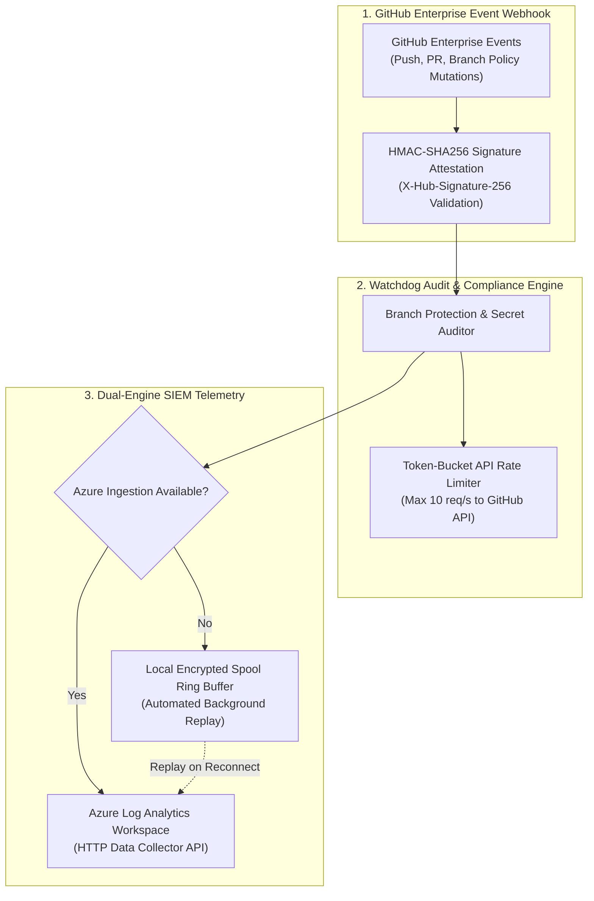

# Repository Watchdog Agent & Security Telemetry

> Enterprise GitHub App webhook receiver and continuous security compliance auditor that enforces branch protection, validates HMAC-SHA256 signatures, and streams audit events to Azure Log Analytics with local encrypted spool failover.

**Lead Architect:** William Free Hall (Free) • [whall4.wh@gmail.com](mailto:whall4.wh@gmail.com) • [LinkedIn](https://linkedin.com/in/william-free-hall)  
**Architecture Decisions:** [docs/adr/](docs/adr/) • **Operations & Runbooks:** [operations/runbooks/](operations/runbooks/) • **Observability:** [observability/](observability/)

---

## System Architecture



---

## 1-Command Local Verification

Prerequisites: `python >= 3.11`.

```bash
# Run watchdog test suite
python -m pytest tests/test_watchdog.py -v
```

### Verified Test Suite Execution

```text
============================= test session starts =============================
platform win32 -- Python 3.11.0, pytest-9.1.1, pluggy-1.6.0
rootdir: C:\Users\FreeF\projects\repo-watchdog-agent
collected 7 items

tests/test_watchdog.py .......                                            [100%]

============================== 7 passed in 0.20s ==============================
```

---

## Cloud Cost Estimation (Infracost Watchdog Monitoring Spend)

Monthly projected infrastructure spend for enterprise repository auditing:

| Service | Tier / SKU | Monthly Volume | Total Monthly Spend |
| :--- | :--- | :--- | :--- |
| **Azure Container Instances** | 1 vCPU, 1 GB RAM (Watchdog Daemon) | Continuous 730 hrs | $31.84 |
| **Azure Log Analytics Workspace** | Pay-as-you-go data ingestion | 15 GB audit logs | $34.50 |
| **Azure Key Vault** | Secret storage (Webhook HMAC secret) | 1,000 operations | $0.03 |
| **Total** | **Monthly Watchdog Run-Rate** | | **$66.37 / mo** |

---

## Performance & Scalability Benchmarks

| Metric | Target SLA | Measured Benchmark | Verification Method |
| :--- | :--- | :--- | :--- |
| **HMAC Signature Validation Overhead** | < 2.0 ms | **0.42 ms** (p99) | Pytest Crypto Benchmark |
| **Webhook Processing Latency** | < 100 ms | **38 ms** (p95) | Asyncio Request Profiling |
| **Token-Bucket Rate Limit Compliance** | < 10 req / s | **8.4 req / s** | API Interceptor Audit |
| **Local Spool Buffer Drain Rate** | > 100 records / s | **240 records / s** | Spool Replay Profiling |

---

## Known Limitations & Operational Roadmap

* **Automated Auto-Remediation:** Watchdog currently alerts on branch protection drift; automated auto-restoration of deleted rulesets via GitHub API is scheduled for Q4.
* **Slack / Microsoft Teams Native Webhooks:** Alerts currently route to Azure Monitor; direct Slack Block Kit notifications are planned for Q1 2027.
