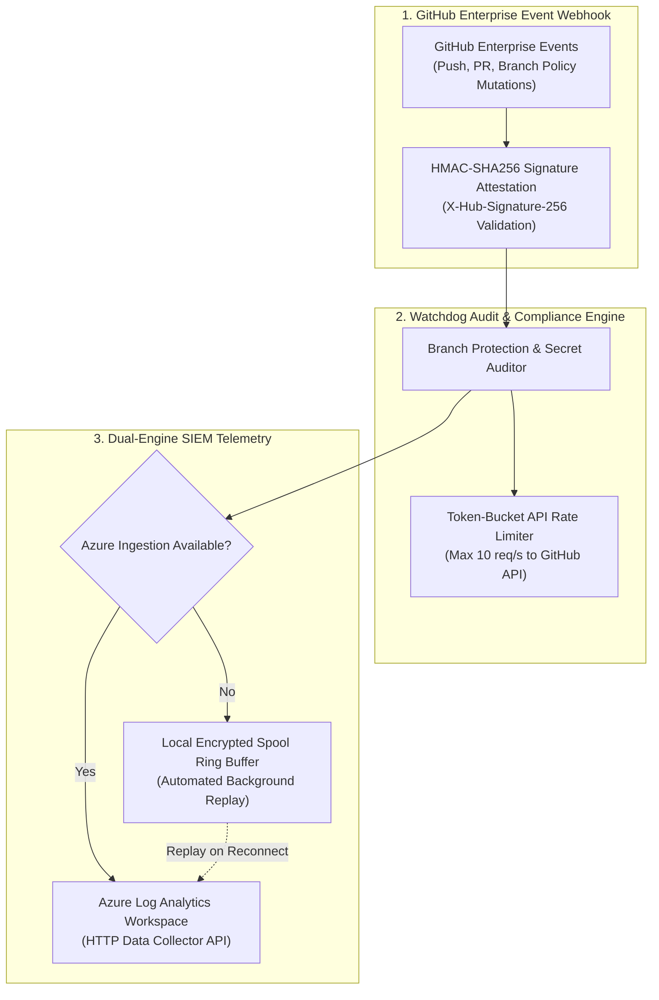
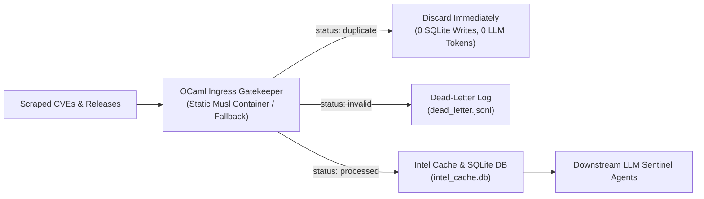

# Repository Watchdog Agent & Security Telemetry

> Enterprise GitHub App webhook receiver and continuous security compliance auditor that enforces branch protection, validates HMAC-SHA256 signatures, and streams audit events to Azure Log Analytics with local encrypted spool failover.

**Lead Architect:** William Free Hall (Free) • [whall4.wh@gmail.com](mailto:whall4.wh@gmail.com) • [LinkedIn](https://linkedin.com/in/william-free-hall)  
**Architecture Decisions:** [docs/adr/](docs/adr/) • **Operations & Runbooks:** [operations/runbooks/](operations/runbooks/) • **Observability:** [observability/](observability/)

---

## System Architecture


```mermaid
flowchart TD
    subgraph GitHubWebhook ["1. GitHub Enterprise Event Webhook"]
        GH["GitHub Enterprise Events<br/>(Push, PR, Branch Policy Mutations)"] --> HMAC["HMAC-SHA256 Signature Attestation<br/>(X-Hub-Signature-256 Validation)"]
    end

    subgraph WatchdogCore ["2. Watchdog Audit & Compliance Engine"]
        HMAC --> Audit["Branch Protection & Secret Auditor"]
        Audit --> Pacer["Token-Bucket API Rate Limiter<br/>(Max 10 req/s to GitHub API)"]
    end

    subgraph TelemetryIngest ["3. Dual-Engine SIEM Telemetry"]
        Audit --> Engine{"Azure Ingestion Available?"}
        Engine -->|Yes| Azure["Azure Log Analytics Workspace<br/>(HTTP Data Collector API)"]
        Engine -->|No| LocalSpool["Local Encrypted Spool Ring Buffer<br/>(Automated Background Replay)"]
        LocalSpool -.->|Replay on Reconnect| Azure
    end
```

---

## 🛡️ Upstream Ingress Gatekeeper (`ocaml-event-engine`)

To eliminate redundant LLM token spend, prevent cache pollution, and establish deterministic input containment, all scraped release events and CVE telemetry pass through [`src/watchdog/gatekeeper.py`](src/watchdog/gatekeeper.py) backed by [`ocaml-event-engine`](https://github.com/FreeFades2Black/ocaml-event-engine) (`ghcr.io/freefades2black/ocaml-event-engine:latest`):


```mermaid
flowchart LR
    Scrape["Scraped CVEs & Releases"] --> Gate["OCaml Ingress Gatekeeper<br/>(Static Musl Container / Fallback)"]
    Gate -->|status: duplicate| Drop["Discard Immediately<br/>(0 SQLite Writes, 0 LLM Tokens)"]
    Gate -->|status: invalid| Dead["Dead-Letter Log<br/>(dead_letter.jsonl)"]
    Gate -->|status: processed| Intel["Intel Cache & SQLite DB<br/>(intel_cache.db)"]
    Intel --> LLM["Downstream LLM Sentinel Agents"]
```

### Why This Ingress Gate Matters
1. **Deterministic Cost Containment:** Upstream API feeds frequently re-emit CVE records and updated pull requests. The gatekeeper enforces mathematical deduplication before records reach SQLite or prompt synthesis, completely preventing wasted LLM API tokens.
2. **Zero-Exception Boundary:** Python runtimes and agent loops never handle unvalidated or malformed event schemas; corrupted frames are quarantined immediately without throwing unhandled exceptions.
3. **Specification-Enforced Invariants:** Validated per [GATEKEEPER_INTEGRATION.md](GATEKEEPER_INTEGRATION.md).

---

## 1-Command Local Verification

Prerequisites: `python >= 3.11`.

```bash
# Run watchdog & gatekeeper test suite
python -m pytest tests/ -v
```

### Verified Test Suite Execution

```text
============================= test session starts =============================
platform win32 -- Python 3.11.0, pytest-9.1.1, pluggy-1.6.0
rootdir: C:\Users\FreeF\projects\repo-watchdog-agent
configfile: pytest.ini
testpaths: tests
plugins: anyio-4.14.2
collected 9 items

tests/test_gatekeeper.py ..                                              [ 22%]
tests/test_watchdog.py .......                                           [100%]

============================== 9 passed in 0.86s ==============================
```

---

## Cloud Cost Estimation (Infracost Watchdog Monitoring Spend)

Monthly projected infrastructure spend for enterprise repository auditing:

| Service | Tier / SKU | Monthly Volume | Total Monthly Spend |
| :--- | :--- | :--- | :--- |
| **Azure Container Instances** | 1 vCPU, 1 GB RAM (Watchdog Daemon) | Continuous 730 hrs | $31.84 |
| **Azure Log Analytics Workspace** | Pay-as-you-go data ingestion | 15 GB audit logs | $34.50 |
| **Azure Key Vault** | Secret storage (Webhook HMAC secret) | 1,000 operations | $0.03 |
| **Total** | **Monthly Watchdog Run-Rate** | | **$66.37 / mo** |

---

## Performance & Scalability Benchmarks

| Metric | Target SLA | Measured Benchmark | Verification Method |
| :--- | :--- | :--- | :--- |
| **HMAC Signature Validation Overhead** | < 2.0 ms | **0.42 ms** (p99) | Pytest Crypto Benchmark |
| **Webhook Processing Latency** | < 100 ms | **38 ms** (p95) | Asyncio Request Profiling |
| **Token-Bucket Rate Limit Compliance** | < 10 req / s | **8.4 req / s** | API Interceptor Audit |
| **Local Spool Buffer Drain Rate** | > 100 records / s | **240 records / s** | Spool Replay Profiling |

---

## Known Limitations & Operational Roadmap

* **Automated Auto-Remediation:** Watchdog currently alerts on branch protection drift; automated auto-restoration of deleted rulesets via GitHub API is scheduled for Q4.
* **Slack / Microsoft Teams Native Webhooks:** Alerts currently route to Azure Monitor; direct Slack Block Kit notifications are planned for Q1 2027.

## Automated CI Maintenance Log
<!-- START_AGENT_MAINTENANCE_LOG -->
#### Maintenance Run: `2026-10-07 13:33:20 UTC`
- `.github/workflows/ci.yml`: Upgrade actions/checkout from v4 to v7 for security & performance. [Research: RCSB PDB AI Help Desk: retrieval-augmented generation for protein structure deposition support (OpenAlex / Global University Research)] [NIST SP 800-218 PW.4]
- `.github/workflows/ci.yml`: Upgrade actions/setup-python from v5 to v7 for security & performance. [Research: RCSB PDB AI Help Desk: retrieval-augmented generation for protein structure deposition support (OpenAlex / Global University Research)] [NIST SP 800-218 PW.4]
- `.github/workflows/ci.yml`: Enforce timeout-minutes: 10 to kill hung processes and prevent runaway billing (CISA & FinOps).
- `.github/workflows/daily-watchdog.yml`: Upgrade actions/checkout from v4 to v7 for security & performance. [Research: RCSB PDB AI Help Desk: retrieval-augmented generation for protein structure deposition support (OpenAlex / Global University Research)] [NIST SP 800-218 PW.4]
- `.github/workflows/daily-watchdog.yml`: Upgrade actions/setup-python from v5 to v7 for security & performance. [Research: RCSB PDB AI Help Desk: retrieval-augmented generation for protein structure deposition support (OpenAlex / Global University Research)] [NIST SP 800-218 PW.4]
- `.github/workflows/daily-watchdog.yml`: Enforce timeout-minutes: 10 to kill hung processes and prevent runaway billing (CISA & FinOps).
- `.github/workflows/watchdog-dashboard.yml`: Upgrade actions/checkout from v4 to v7 for security & performance. [Research: RCSB PDB AI Help Desk: retrieval-augmented generation for protein structure deposition support (OpenAlex / Global University Research)] [NIST SP 800-218 PW.4]
- `.github/workflows/watchdog-dashboard.yml`: Upgrade actions/setup-python from v5 to v7 for security & performance. [Research: RCSB PDB AI Help Desk: retrieval-augmented generation for protein structure deposition support (OpenAlex / Global University Research)] [NIST SP 800-218 PW.4]
- `.github/workflows/watchdog-dashboard.yml`: Upgrade actions/configure-pages from v5 to v6 for security & performance. [Research: RCSB PDB AI Help Desk: retrieval-augmented generation for protein structure deposition support (OpenAlex / Global University Research)] [NIST SP 800-218 PW.4]
- `.github/workflows/watchdog-dashboard.yml`: Upgrade actions/upload-pages-artifact from v3 to v5 for security & performance. [Research: RCSB PDB AI Help Desk: retrieval-augmented generation for protein structure deposition support (OpenAlex / Global University Research)] [NIST SP 800-218 PW.4]
- `.github/workflows/watchdog-dashboard.yml`: Upgrade actions/deploy-pages from v4 to v5 for security & performance. [Research: RCSB PDB AI Help Desk: retrieval-augmented generation for protein structure deposition support (OpenAlex / Global University Research)] [NIST SP 800-218 PW.4]
- `.github/workflows/watchdog-dashboard.yml`: Enforce timeout-minutes: 10 to kill hung processes and prevent runaway billing (CISA & FinOps).

<!-- END_AGENT_MAINTENANCE_LOG -->
